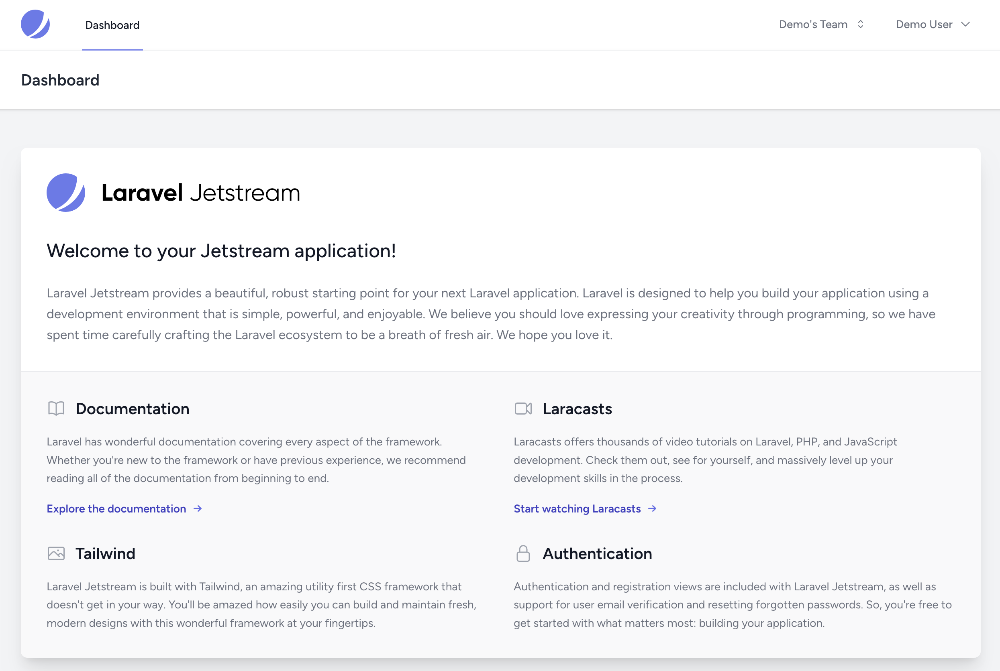

<p align="center"><a href="https://laravel.com" target="_blank"></a> <h1 align="center">Starter App</h1></p>




# Introduction

This Repository contains a Laravel Starter App based on Jetstram and Livewire with some adaptions.

## How to use


```
git clone https://github.com/r14r/Laravel_Tutorial_Erstellen-einer-Starter-App Starter-App
```

```
cd Starter-App
```

```
cp .env.example  .env
composer install
npm install
npm run build
```

```
php artisan migrate
php artisan key:generate
php artisan serve
```
